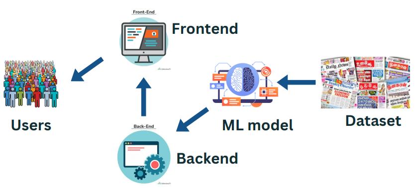
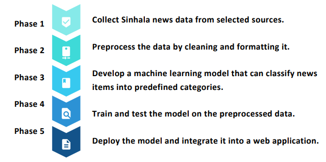

[comment]: # "This is the standard layout for the project, but you can clean this and use your own template"

# Automatically categorizing Sinhala news items from selected news sources

---

[comment]: # "This is a sample image, to show how to add images to your page. To learn more options, please refer [this](https://projects.ce.pdn.ac.lk/docs/faq/how-to-add-an-image/)"

## Team
-  E/18/077, Dharmarathna N.S., [email](mailto:e18077@eng.pdn.ac.lk)
-  E/18/224, Mihiranga G.D.R., [email](mailto:e18224@eng.pdn.ac.lk)
-  E/18/227, Mudalige D.H., [email](mailto:e18227@eng.pdn.ac.lk)

## Table of Contents
1. [Introduction](#introduction)
2. [Problem](#problem)
3. [Aim](#aim)
4. [Objectives](#objectives)
5. [Proposed solution](#proposedsolution)
6. [Solution Architecture](#solutionarchitecture)
7. [Tools and Technologies](#toolsandtechnologies)
8. [Plan of Work](#planofwork)
9. [Links](#links)

---

## Introduction
* In the modern world, with the abundance of information available on the internet, it has become challenging to filter out relevant information from a vast amount of data.
* Sinhala is the primary language spoken in Sri Lanka, and many online news
sources publish news articles in Sinhala.
* With the increasing demand for relevant news, it is necessary to categorize the
Sinhala news items from different news sources automatically.
* Automated text classification is a great option for this. It is the process of using machine learning algorithms and natural language processing techniques to
automatically categorize text documents into predefined categories or classes.

## Problem
The primary problem addressed by this project is the lack of tools available for
automatically categorizing Sinhala news articles. This creates a challenge for readers to find relevant articles quickly and for news organizations to effectively manage their content.

## Aim
The aim of this project is to develop an automated system that categorizes Sinhala
news items based on their content to make it easier for readers to find relevant
articles quickly and for news organizations to effectively manage their content.

## Objectives
* To collect a dataset of Sinhala news articles from selected news sources.
* To preprocess and clean the data to prepare it for analysis.
* To develop a machine learning model that can accurately categorize news articles.
* To evaluate the performance of the model using various metrics.
* To deploy the model as a web application to make it accessible to users.

## Proposed solution
* The proposed solution is to use machine learning algorithms to categorize Sinhalanews items.
* The system will be trained using a dataset of manually categorized Sinhala news items.
* The system will use natural language processing techniques to extract the relevant features from the news items
* Use machine learning algorithms to categorize the news items.

Impact/Business Value:
* Reduce the time and resources spent on categorization process
* Improve consistency of categorization process

Success Measurements:
* Accuracy of the model on test dataset
* Reduction in time and resources spent on categorization process

User Stories/Use Case Scenarios:
* Journalists can use the tool to categorize news items quickly and accurately
* News agencies can use the tool to automate their categorization process and save resources
* When a news reader wants to view news items in a specific category.

## Solution Architecture

## Tools and Technologies
For natural language processing and machine learning
1. LTK (Natural Language Toolkit)
2. Scikit-learn:
3. Pandas:
4. Numpy:
5. PyTorch:

Web application development
1. MERN stack

## Plan of Work
Outline

Considerations for extendability
* Addition of new categories and sources in the future.
* The model can be extended to other languages
* The tool can be integrated with other news platforms
* Developing a mobile based application

Team, Strengths, and Expertise:
* Machine learning,natural language processing, web development.
* Our team has experience working with Python programming, machine learning and web development.

## Links
- [Project Repository](https://github.com/cepdnaclk/e18-6sp-Automatically-categorizing-Sinhala-news-items-from-selected-news-sources)
- [Project Page](https://cepdnaclk.github.io/e18-6sp-Automatically-categorizing-Sinhala-news-items-from-selected-news-sources)
- [Department of Computer Engineering](http://www.ce.pdn.ac.lk/)
- [University of Peradeniya](https://eng.pdn.ac.lk/)

[//]: # (Please refer this to learn more about Markdown syntax)
[//]: # (https://github.com/adam-p/markdown-here/wiki/Markdown-Cheatsheet)
